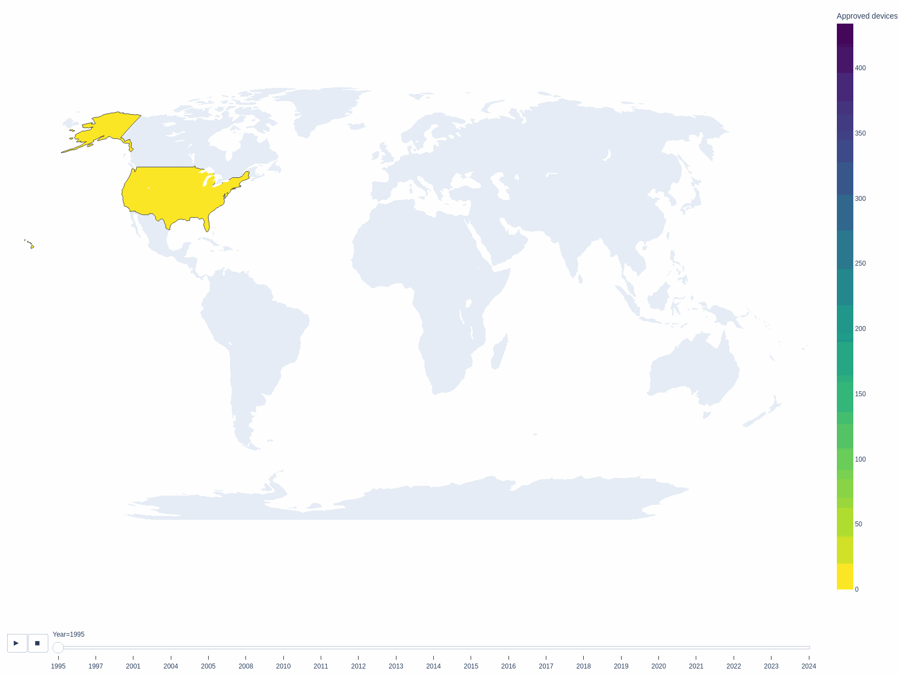

# Generalizability of AI-Enabled Medical Devices Approved for Clinical Use

## Overview
Artificial intelligence (AI)-enabled medical devices are increasingly used, yet details about their clinical generalizability remain unclear.
We identified and analyzed key characteristics of AI-enabled medical devices approved by the U.S. Food and Drug Administration (FDA) that are relevant to their generalizability.

[//]: # (![alt Abstract]&#40;plots/Figure2_cropped.png&#41;)


## Repository contents
The notebooks `plots.ipynb` and `tables.ipynb` contain the code to generate all plots and tables reported in the paper.
The dataset will be released after approval.

[//]: # (`dataset_fda_devices.xlsx` is the cleaned dataset used for all the analysis.)


## Citation
Please cite the following paper if you use this repository or data.

Windecker D, Baj G, Shiri I, Mohammadi Kazaj P, Kaesmacher J, Gräni C, Siontis GC. Generalizability of AI-Enabled Medical Devices Approved for Clinical Use. 2024 In submission.

```
@article{windecker2025generalizability,
  title     = {Generalizability of FDA-Approved AI-Enabled Medical Devices for Clinical Use},
  author    = {Windecker, Daniel and Baj, Giovanni and Shiri, Isaac and Kazaj, Pooya Mohammadi and Kaesmacher, Johannes and Gr{\"a}ni, Christoph and Siontis, George C. M.},
  journal   = {JAMA Network Open},
  volume    = {8},
  number    = {4},
  pages     = {e258052},
  year      = {2025},
  doi       = {10.1001/jamanetworkopen.2025.8052},
  url       = {https://jamanetwork.com/journals/jamanetworkopen/fullarticle/2819868},
  publisher = {American Medical Association}
}
```
```
Windecker, Daniel, Giovanni Baj, Isaac Shiri, Pooya Mohammadi Kazaj, Johannes Kaesmacher, Christoph Gräni, and George C. M. Siontis. 2025.
“Generalizability of FDA-Approved AI-Enabled Medical Devices for Clinical Use.”
JAMA Network Open 8 (4): e258052. https://doi.org/10.1001/jamanetworkopen.2025.8052.
```

